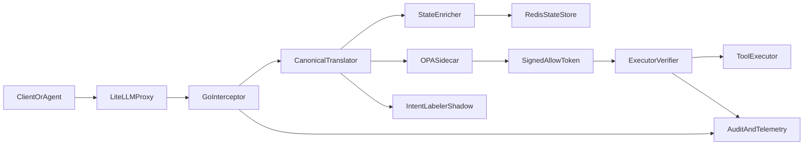

# AGENTS.md

This repository builds Arbiter, a deterministic governance layer for LLM agent tool execution.
Use this file as the working contract for future implementation work.

## Mission

Build a Go-first hot-path enforcement system that intercepts tool calls, normalizes them into a canonical schema, evaluates policy with OPA, and blocks any execution that lacks a valid signed allow token.

## Architecture Summary

### Hot-path services
- `interceptor`: receives or reconstructs tool-call requests, applies bounded buffering, and orchestrates validation.
- `translator`: converts provider-native tool-call payloads into a versioned canonical contract.
- `pdp`: evaluates Rego policies through a local OPA sidecar and returns allow or deny results.
- `executorauth`: verifies allow tokens at execution time, including expiry, signer, request hash, and replay status.
- `state`: injects prior-action context from Redis for sequence-aware policies.

### Supporting services
- `intent`: semantic labeler used in shadow mode first.
- `control-plane`: Next.js app for policy/data management, audit review, and rollout workflows.
- `audit` and `telemetry`: structured logging, metrics, traces, and latency budget reporting.

## Target Architecture Diagram



## Non-Negotiable Invariants

- No tool executes without a valid signed allow token.
- OPA or token verification failure is always fail-closed.
- The executor must verify the token itself. Do not trust upstream approval alone.
- The labeler is non-blocking until it is explicitly promoted from shadow mode.
- Required temporal context must be present for sequence-aware policies; otherwise deny.
- The control plane must not sit on the request hot path.

## Trust Boundaries

Treat these boundaries as explicit during design and implementation:

1. Agent or client to gateway.
2. Gateway to interceptor.
3. Interceptor to OPA sidecar.
4. Interceptor to Redis-backed state context.
5. Interceptor to tool executor.
6. Control plane to policy and data distribution.

Design against direct tool execution, replayed approvals, forged tokens, stale policy data, and alternate execution paths that bypass the interceptor.

## Recommended Implementation Order

1. Bootstrap the Go module and package layout.
2. Define the canonical schema and version it from day one.
3. Add golden fixtures for OpenAI-style, Anthropic-style, and framework-generated tool calls.
4. Implement the OPA client, base policy packages, and signed allow-token flow.
5. Implement execution-time token verification and replay protection.
6. Build the LiteLLM-first streaming interceptor with strict buffering and timeout limits.
7. Add Redis-backed temporal state enrichment.
8. Build structured audit logging and telemetry.
9. Add the control plane for policy rollout and simulation.
10. Integrate the intent labeler in shadow mode only.

## Repository Expectations

Prefer this layout unless a strong reason emerges to change it:

```text
cmd/interceptor/
internal/schema/
internal/translator/
internal/pdp/
internal/executorauth/
internal/state/
internal/intent/
internal/audit/
internal/telemetry/
policy/core/
policy/domain/
policy/data/
policy/tests/
apps/control-plane/
deploy/
```

## Implementation Guidelines

### Go hot path
- Keep hot-path logic small, explicit, and allocation-aware.
- Use `context.Context` consistently for deadlines and cancellation.
- Bound memory use for streamed argument buffering.
- Propagate structured errors with enough metadata for audit logs.

### Canonical schema
- Treat the canonical schema as the contract boundary, not provider JSON.
- Include schema version, tenant, actor, session metadata, tool name, normalized parameters, derived state context, and decision metadata.
- Reject unknown or ambiguous payloads unless they normalize safely.

### Policy design
- Separate `policy/core/` for system-wide invariants from `policy/domain/` for tool-specific controls.
- Keep policy evaluation deterministic and cheap.
- Do not pull live remote data from Rego on the hot path.
- Version policy and data artifacts so every decision is traceable.

### Token design
- Bind tokens to request hash, tenant, actor, tool, policy version, expiry, and `jti`.
- Keep tokens short-lived.
- Plan for replay protection and key rotation from the start.

### Control plane
- Keep it out of the request path.
- Support `draft`, `shadow`, `canary`, `enforced`, and rollback workflows.
- Show decision history, policy versions, and simulation results.

## Testing Standards

- Create tests for every package with business logic.
- Add golden tests for normalization and schema compatibility.
- Add `opa test` coverage for policy behavior.
- Add replay tests for policy revisions and shadow mode.
- Add fuzz tests for malformed payloads and stream reconstruction.
- Add load and fault-injection coverage for OPA, Redis, and labeler dependency failure modes.

## Documentation Discipline

When adding a new service or package:

- Update `README.md` if the public architecture or setup story changes.
- Update this file if the service boundary, implementation order, or invariants change.
- Keep examples aligned with the current canonical schema version.

## Build Progress

- [x] Bootstrap the Go module and package layout.
- [x] Define the versioned canonical schema and request hashing.
- [x] Add OpenAI normalization and golden-style translation tests.
- [x] Implement OPA decisioning and signed execution-token flow.
- [x] Implement execution-time token verification with replay protection.
- [x] Build the HTTP interception service and action-recording endpoints.
- [x] Add initial Rego policies, policy data, and local Docker runtime wiring.
- [x] Add focused unit tests for schema, translation, PDP, token verification, state, and service handlers.
- [x] Add streamed tool-call chunk reconstruction.
- [x] Add Anthropic adapter.
- [x] Add framework adapters.
- [x] Add first-class tracing.
- [x] Add CI automation for `go test` and `opa test`.
- [x] Add first-class in-process metrics and `/metrics` endpoint.
- [x] Expand baseline policy regression coverage for SQL, Slack, Stripe, and temporal context.
- [x] Add chunk-phase stream intercept route with fast early deny gate.
- [x] Add end-to-end integration tests that cover OPA decisioning, Redis-backed replay protection, and required-context history.
- [x] Add OTLP trace export plumbing and latency SLO instrumentation.
- [x] Build the control-plane MVP for policy CRUD, rollout-state management, audit views, and request simulation.
- [x] Add signing-key rotation hardening and pilot readiness documentation.
- [x] Add local LiteLLM harness examples and Docker wiring for client-style integration tests.
- [x] Publish first-class API contracts in `api/` (OpenAPI + canonical/decision JSON schemas + examples).
- [x] Add interceptor readiness endpoint and optional trust-boundary shared-key enforcement for gateway/service routes.
- [x] Add control-plane bundle lifecycle primitives (publish, activate, active bundle, revision and activation history APIs).
- [x] Add Postgres-backed control-plane persistence with SQL migrations and JSON-store fallback compatibility.
- [x] Add authenticated bundle artifact and channel-manifest APIs for control-plane bundle distribution.
- [x] Add channel artifact endpoint with digest-aware caching semantics and auto-bootstrap for empty environments.
- [x] Wire local Docker runtime for control-plane + Postgres + OPA bundle polling via service-token authentication.
- [x] Add control-plane service-token management APIs (list/create/revoke) with hashed token storage.
- [x] Add first-class Python integration packages under `integrations/` for LiteLLM and OpenClaw adoption paths.
- [x] Integrate a non-blocking shadow-mode intent labeler interface (`internal/intent/`) into canonical interception.
- [ ] Promote the control-plane MVP beyond local file-backed storage into production policy and data distribution workflows.

## Immediate Build Targets

The next code changes should usually start here:

1. `apps/control-plane/` to complete migration from JSON fallback to production datastore defaults and tenant-aware access controls.
2. `apps/control-plane/` to finish policy/data distribution workflows (channel promotion semantics, artifact caching, and production key/service-token management).
3. `deploy/` and runtime wiring to add signed bundle verification and key-management for OPA bundle distribution.
4. Pilot-environment validation: run the live soak test and validate alerting/dashboards/OTLP traces against real traffic.
5. Package and publish integration SDKs (versioning, changelog, distribution metadata, and semver support policy).

## Production Pilot Sequence

Execute these steps in order. After each step, update this section and `README.md` immediate next steps, then push.

- [x] Step 1: Add edge-case and adversarial policy fixtures in `policy/tests/`.
- [x] Step 2: Add end-to-end integration tests for OPA, Redis, and replay protection.
- [x] Step 3: Add distributed tracing export plumbing (OTLP) and latency SLO instrumentation.
- [x] Step 4: Build control-plane MVP for policy/data CRUD, rollout states, and audit views.
- [x] Step 5: Add key rotation hardening and pilot readiness verification checklist.
- [ ] Step 6: Run the live pilot soak test in the target environment.
- [ ] Step 7: Validate alerting, dashboards, and OTLP-backed traces against real traffic.
