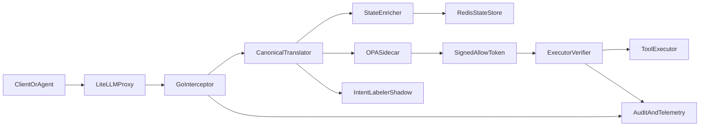

# Arbiter

Arbiter is a deterministic governance layer for LLM agent tool execution.
It sits between an agent runtime and the tools that agent wants to call, normalizes provider-specific tool-call payloads into a canonical schema, evaluates policy with Open Policy Agent (OPA), and only allows execution when a short-lived signed policy token is present and valid.

The product goal is simple: agent reasoning can stay probabilistic, but tool execution must be deterministic.

## Status

This repository is currently in bootstrap phase. The first milestone is to establish the core contracts, hot-path services, and policy layout for an MVP.

## MVP Principles

- Deterministic enforcement first.
- Fail closed on OPA or token verification failure.
- Keep the intent labeler in shadow mode until latency and quality are proven.
- Use temporal context only for policies that require prior-action state.
- Keep the control plane off the request hot path.

## Target Architecture



## Planned Services

### `interceptor`
- Go service on the hot path.
- Reconstructs streaming tool calls.
- Runs early tool-name checks and full argument validation.
- Denies malformed or disallowed calls before execution.

### `pdp`
- Local OPA sidecar and Go client integration.
- Evaluates core and domain Rego policies.
- Returns allow or deny decisions and supports signed allow-token flow.

### `executorauth`
- Verifies signed allow tokens at execution time.
- Enforces request-hash binding, expiry, signer trust, and replay protection.

### `state`
- Enriches requests with temporal context from Redis.
- Supports sequence-aware policies such as "delete only after backup."

### `intent`
- Optional semantic labeler for shadow evaluation.
- Measures classification quality and latency before any enforcement role.

### `control-plane`
- Next.js application for policy data CRUD, audit review, and shadow simulation.
- Manages rollout states such as `draft`, `shadow`, `canary`, and `enforced`.

## Planned Repository Shape

```text
cmd/interceptor/
internal/schema/
internal/translator/
internal/pdp/
internal/executorauth/
internal/state/
internal/intent/
internal/audit/
internal/telemetry/
policy/core/
policy/domain/
policy/data/
policy/tests/
apps/control-plane/
deploy/docker-compose.yml
deploy/helm/
```

## Delivery Order

1. Define the canonical schema, decision contract, and signed-token claims.
2. Implement the OPA integration and deterministic policy path.
3. Add execution-time token verification and replay protection.
4. Build the LiteLLM-first streaming interceptor.
5. Add Redis-backed temporal context enrichment.
6. Build the control plane and policy rollout workflow.
7. Add the intent labeler in shadow mode.

## Security Invariants

- No tool executes without a valid signed allow token.
- The executor must verify the token, not just the interceptor.
- Unknown or malformed provider payloads are denied unless they normalize cleanly.
- Missing required temporal context causes a deny for policies that depend on it.
- Every decision must be traceable by decision ID, policy version, and data revision.

## Testing Expectations

- Unit tests for each Go package with logic.
- Golden fixtures for canonical translation.
- `opa test` coverage for policy modules.
- Replay tests for historical decisions.
- Load and chaos tests for hot-path dependencies.

## Immediate Next Steps

1. Initialize the Go module and create the core package layout.
2. Define the versioned canonical schema under `internal/schema/`.
3. Add provider fixtures and translator tests.
4. Create the first OPA policy bundles under `policy/core/` and `policy/domain/`.
5. Stand up a local development stack with OPA and Redis.
