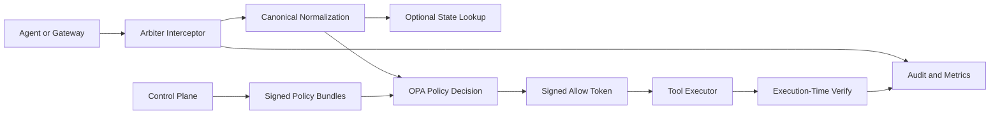

# Arbiter

Arbiter is a gatekeeper for LLM agent tool calls. It decides whether a tool call is allowed, and proves that decision with a short-lived signed token that the tool executor must verify before doing real work.

**Status:** alpha. The repo is in good shape for local demos, technical evaluation, and early pilot deployments.

## Why Arbiter

LLM reasoning is probabilistic. Tool execution should not be.

Arbiter sits between an agent runtime and the tools that can cause side effects. Instead of relying on the model to self-police, Arbiter:

- normalizes provider-specific tool calls into one canonical request shape,
- evaluates them with deterministic Rego policy in OPA,
- issues a signed allow token only when policy passes,
- requires the executor to verify that token again at execution time,
- blocks replay and records the decision for audit and observability.

This gives you a clear control point for actions like SQL, Slack, payments, file access, and other external tools.

## Who It Is For

- Hobbyists who want a real guardrail layer around local agent projects instead of prompt-only safety checks.
- Teams using LiteLLM, LangChain, OpenAI-style, Anthropic-style, or custom tool-call flows.
- Enterprise evaluators who care about deterministic policy, trust boundaries, signed approvals, audit trails, and rollout controls.

## What Arbiter Does

- Deterministic policy enforcement with OPA and Rego.
- Example policy packs for SQL, Slack, Stripe, and OpenClaw-style filesystem and shell guardrails.
- Signed allow tokens bound to request hash, tenant, actor, tool, and policy version.
- Replay protection so one approval cannot be reused.
- Provider normalization for OpenAI, Anthropic, LangChain-style, and generic framework envelopes.
- Streamed OpenAI tool-call reconstruction with bounded buffering and an optional early deny gate.
- Sequence-aware policy by looking up recent actions from Redis or local embedded storage.
- Governance workflows in a control plane for bundle publication, rollout, approval, signing keys, and service tokens.

## What Arbiter Does Not Do

- It does not host models or run your tools for you.
- It does not replace sandboxing, least-privilege IAM, or secret management.
- It does not use an LLM as the final safety judge.
- It is not yet a fully hardened multi-tenant SaaS control plane.

## How It Works



The key design choice is that the control plane stays off the hot path. Enforcement happens in the interceptor plus local policy evaluation. Governance happens separately through signed policy bundles and rollout workflows.

## Two-Minute Local Runtime (No Docker)

### 1. Initialize local runtime config

```bash
go run ./cmd/arbiter local init
```

This creates `~/.arbiter/config.json` with local defaults, local data storage, and a signing secret.

### 2. Start local runtime

```bash
go run ./cmd/arbiter local start
```

Local runtime listens on `http://127.0.0.1:8080` by default.

### 3. Check runtime status

```bash
go run ./cmd/arbiter local status
```

### 4. Send an allowed tool call

```bash
curl -s -X POST http://127.0.0.1:8080/v1/intercept/openai \
  -H 'Content-Type: application/json' \
  -d @api/examples/openai-intercept-request.json
```

## Five-Minute Demo

### 1. Start the local stack

```bash
docker compose -f deploy/docker-compose.yml up --build -d
```

This starts:

- Arbiter on `http://localhost:8080`
- Control plane on `http://localhost:3000`
- OPA on `http://localhost:8181`
- Redis on `localhost:6379`
- Postgres on `localhost:5432`

### 2. Send an allowed tool call

```bash
curl -s -X POST http://localhost:8080/v1/intercept/openai \
  -H 'Content-Type: application/json' \
  -d @api/examples/openai-intercept-request.json
```

Expected result: HTTP `200`, `decision.allow: true`, and a non-empty `token`.

### 3. Send a denied tool call

```bash
curl -s -X POST http://localhost:8080/v1/intercept/openai \
  -H 'Content-Type: application/json' \
  -d '{
    "metadata": {"request_id": "demo-deny-1", "tenant_id": "tenant-demo"},
    "agent_context": {"actor": {"id": "user-1"}},
    "tool_call": {
      "type": "function",
      "function": {
        "name": "run_sql_query",
        "arguments": "{\"query\":\"DROP TABLE users;\"}"
      }
    }
  }'
```

Expected result: HTTP `403`, `decision.allow: false`, and no token.

### 4. Verify the token, then verify it again

Replace `<SIGNED_ALLOW_TOKEN>` in [canonical-verify-request.json](api/examples/canonical-verify-request.json) with the token from step 2, then run:

```bash
curl -s -X POST http://localhost:8080/v1/execute/verify/canonical \
  -H 'Content-Type: application/json' \
  -d @api/examples/canonical-verify-request.json
```

Expected result: first verify returns HTTP `200` with `{"status":"verified"}`. Running the same request a second time should return HTTP `403` because the token is single-use.

## Supported Now

| Capability | Status | Notes |
|---|---|---|
| OpenAI-style tool calls | Supported | `POST /v1/intercept/openai` |
| Streamed OpenAI tool calls | Supported | chunk reconstruction plus optional early deny gate |
| Anthropic `tool_use` | Supported | `POST /v1/intercept/anthropic` |
| Generic framework envelopes | Supported | generic and LangChain-style endpoints |
| Signed allow tokens | Supported | short-lived JWTs with request binding |
| Replay protection | Supported | memory or Redis-backed |
| Required context enforcement | Supported | recent-action lookup from state store |
| Redis-backed temporal state | Supported | sequence-aware policy for distributed deployments |
| Local embedded temporal state | Supported (alpha) | sequence-aware policy for no-Docker local runtime |
| Control plane | Supported | policy, bundle, approval, token, and signing-key workflows |
| Signed OPA bundle distribution | Supported | service-token auth plus bundle signatures |
| Python integration wrappers | Supported | LiteLLM and OpenClaw/generic wrappers |
| OpenClaw native plugin | Supported (alpha) | `integrations/openclaw-plugin` (`before_tool_call` + verify + state record) |
| Local runtime (no Docker) | Supported (alpha) | `go run ./cmd/arbiter local init/start/status` |
| Multi-tenant enterprise hardening | In progress | current model is strong for pilots, not final for broad self-serve use |

## Deployment Stages

| Stage | Best for | Recommended shape | Ready now | Notable gaps |
|---|---|---|---|---|
| Local demo | hobby projects, screenshots, quick eval | `docker compose` stack with bundled defaults | Yes | dev secrets, single machine, not internet-facing |
| Pilot | internal team trial, limited real workflows, design partners | Go interceptor + OPA + Redis + Postgres-backed control plane + signed bundles + audit/metrics | Yes, with operator oversight | more multi-tenant hardening, deployment packaging, and runbook maturity still needed |
| Production target | business-critical agent workflows | HA deployment, external secret management, hardened identity, key management, monitoring, rollback, isolated executors | Not yet | control-plane hardening, broader integrations, formal support posture, and more operational automation |

## Enterprise Evaluation Notes

- The control plane is not in the decision hot path. Arbiter can continue enforcing with local OPA even if the UI is unavailable.
- Policies are distributed as signed bundles. OPA fetches them from the control plane with a service token and verifies signatures before activation.
- Execution requires two checks: intercept-time allow and execution-time token verification.
- Decisions are traceable by decision ID, policy version, data revision, request ID, and trace ID.
- Production bundle promotion and rollback can be approval-gated in the control plane.
- The stack exposes metrics, tracing, and audit events for pilot validation and operational review.

## Current Limits

- The project is still alpha.
- OpenClaw native plugin support is alpha and currently optimized for stock filesystem/process tools.
- Control-plane multi-tenant governance still needs more hardening before calling it broadly enterprise-ready.
- Arbiter should be paired with real executor isolation and least-privilege credentials. It is one layer in a defense-in-depth design, not the whole system.

## Docs By Use Case

- Quick evaluation with a real model: [examples/litellm-harness/README.md](examples/litellm-harness/README.md)
- OpenClaw native plugin setup: [integrations/openclaw-plugin/README.md](integrations/openclaw-plugin/README.md)
- Python SDK wrappers: [integrations/python/README.md](integrations/python/README.md)
- Integration package overview: [integrations/README.md](integrations/README.md)
- Control plane workflows and APIs: [apps/control-plane/README.md](apps/control-plane/README.md)
- Contribution guide: [CONTRIBUTING.md](CONTRIBUTING.md)
- Security reporting: [SECURITY.md](SECURITY.md)
- Pilot soak runbook: [pilot-soak-runbook.md](docs/pilot-soak-runbook.md)
- Pilot readiness checklist: [pilot-readiness-checklist.md](docs/pilot-readiness-checklist.md)
- HTTP contract: [openapi.yaml](api/openapi.yaml)
- Canonical request schema: [canonical-request.v1alpha1.schema.json](api/schemas/canonical-request.v1alpha1.schema.json)
- Signed decision schema: [signed-decision.schema.json](api/schemas/signed-decision.schema.json)

## API At A Glance

- `GET /healthz`
- `GET /readyz`
- `GET /metrics`
- `POST /v1/intercept/openai`
- `POST /v1/intercept/openai/stream`
- `POST /v1/intercept/openai/stream/race`
- `POST /v1/intercept/anthropic`
- `POST /v1/intercept/framework/generic`
- `POST /v1/intercept/framework/langchain`
- `POST /v1/execute/verify/openai`
- `POST /v1/execute/verify/anthropic`
- `POST /v1/execute/verify/canonical`
- `POST /v1/state/actions`

If you configure trust-boundary headers, intercept routes require `X-Arbiter-Gateway-Key` and verify or state routes require `X-Arbiter-Service-Key`.

## Writing Policies

Arbiter policy is split into:

- `policy/core/` for global invariants,
- `policy/domain/` for tool-specific rules,
- `policy/data/` for static policy data,
- `policy/tests/` for normal and adversarial policy tests.

Run the local validation loop with:

```bash
go test ./...
docker run --rm -v "$PWD/policy:/policy:ro" openpolicyagent/opa:latest test /policy/core /policy/domain /policy/tests /policy/data -v
```

## Security Invariants

- No tool should execute without a valid signed allow token.
- The executor must verify the token. Upstream approval is not enough.
- Unknown or malformed tool-call payloads are denied unless they normalize safely.
- Missing required context should fail closed for context-dependent policies.
- Policy and data versions should be attached to every decision so the result is explainable later.

## License

Apache 2.0. See [LICENSE](LICENSE).
