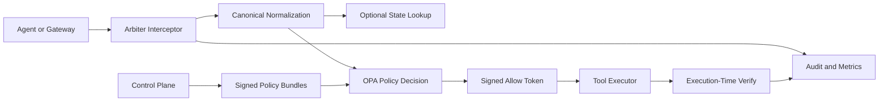

# Arbiter

Arbiter is a gatekeeper for LLM agent tool calls. It decides whether a tool call is allowed, and proves that decision with a short-lived signed token that the tool executor must verify before doing real work.

**Status:** alpha. The repo is in good shape for local demos, technical evaluation, and early pilot deployments.

## Why Arbiter

LLM reasoning is probabilistic. Tool execution should not be.

Arbiter sits between an agent runtime and the tools that can cause side effects. Instead of relying on the model to self-police, Arbiter:

- normalizes provider-specific tool calls into one canonical request shape,
- evaluates them with deterministic Rego policy in OPA,
- issues a signed allow token only when policy passes,
- requires the executor to verify that token again at execution time,
- blocks replay and records the decision for audit and observability.

This gives you a clear control point for actions like SQL, Slack, payments, file access, and other external tools.

## MCP Gateway (experimental)

`arbiter-mcp` governs an existing remote MCP JSON-RPC server without requiring
the server to add Arbiter code. It filters `tools/list` through policy and
requires every `tools/call` to receive and consume a single-use Arbiter permit
before the request is forwarded upstream.

```bash
ARBITER_MCP_UPSTREAM_URL=http://127.0.0.1:9000/mcp \
go run ./cmd/arbiter-mcp
```

For a local stdio server, set `ARBITER_MCP_STDIO_COMMAND` and optional
space-separated `ARBITER_MCP_STDIO_ARGS` instead of an upstream URL. The
gateway keeps one line-delimited JSON-RPC subprocess connection and applies
the identical discovery and execution enforcement path.

The gateway listens at `http://127.0.0.1:8090/mcp`. Configure
`ARBITER_MCP_SERVER_ID` to make the upstream server part of the authorization
and permit binding. `ARBITER_GATEWAY_SHARED_KEY` is available for development
and legacy integration; production deployments should inject an authenticated
workload principal and scoped capability verifier through the Go gateway API.

MCP tool discovery is non-side-effecting and uses the `mcp.tools/list`
operation. Tool invocation uses `mcp.tools/call`; it binds the MCP server, tool
name, arguments, authenticated principal, policy obligations, delegation path,
and capability grant to the execution permit.

For a signed workload-JWT deployment, set `ARBITER_MCP_JWT_SECRET`,
`ARBITER_MCP_JWT_ISSUER`, and `ARBITER_MCP_JWT_AUDIENCE`. To enforce scoped
grants in production, set `ARBITER_CAPABILITY_ALGORITHM=RS256`, keep
`ARBITER_CAPABILITY_PRIVATE_KEY` only on the control plane, give each MCP
gateway the matching `ARBITER_CAPABILITY_PUBLIC_KEY`, and set
`ARBITER_REQUIRE_CAPABILITY=true`; the caller then sends a grant in
`X-Arbiter-Capability`. `ARBITER_CAPABILITY_SECRET` remains supported for
HS256 local development and backwards compatibility. Delegation chains are
enabled with `ARBITER_DELEGATION_SECRET` and use
`X-Arbiter-Delegation: <parent-link>,<child-link>`.

In Postgres control-plane deployments, approvers can create, list, and revoke
these credentials at `/api/capability-grants`. The raw grant is returned only
at creation time; revocation is audited. Set `ARBITER_REDIS_ADDR` on the MCP
gateway for shared runtime revocation state.

Set `ARBITER_CAPABILITY_REVOCATION_ENDPOINTS` to the comma-separated
service-key-protected gateway `POST /v1/capabilities/revoke` URLs and set the
matching `ARBITER_SERVICE_SHARED_KEY` on the control plane. Revocation is then
durable in Postgres and fanned out automatically with the grant ID and original
expiry; the gateway writes the shared Redis revocation marker immediately.
Without these settings, operators can call that endpoint directly to synchronize
active gateways.

Set `ARBITER_PRODUCTION_MODE=true` on an MCP gateway to enforce its strict
enterprise baseline: authenticated workload identity, RS256 execution permits,
Redis-backed replay and state, durable Postgres audit, inbound gateway and
revocation service keys, and required RS256 capability grants. This startup
check deliberately rejects static-agent and shared-HMAC capability defaults.

For production OIDC workloads, prefer `ARBITER_MCP_OIDC_ISSUER`,
`ARBITER_MCP_OIDC_AUDIENCE`, and `ARBITER_MCP_OIDC_JWKS_URL`. Arbiter validates
RS256 tokens against a bounded, cached JWKS and fails closed if key discovery
or token validation fails.

For human-in-the-loop policy obligations, configure `ARBITER_APPROVAL_SECRET`.
An approver issues a short-lived `X-Arbiter-Approval` receipt for a canonical
action hash; the receipt cannot approve a modified action, another tenant, or
another principal. The default policy demonstrates a `financial` approval
obligation for MCP Stripe refunds.

## Policy-Owned Context

Version `v1alpha2` canonical requests support policy-issued obligations. The
default policy demonstrates a `recent_actions` obligation for `delete_backup`.
Arbiter resolves this bounded history from trusted state before final policy
evaluation. A protocol client cannot bypass the requirement by omitting a
`required_context` field; that legacy field remains only for `v1alpha1`
compatibility.

## Identity, Delegation, and Capabilities (experimental)

The MCP gateway accepts an `identity.Authenticator` and validates a principal
separately from provider-controlled actor metadata. Built-in authenticators
cover local static configuration, signed workload JWTs, and verified mTLS URI
SANs. Signed delegation links are supplied through `X-Arbiter-Delegation` and
must form an attenuating parent-to-child chain ending at the authenticated
principal.

A capability verifier can require `X-Arbiter-Capability`: a short-lived signed
grant scoped to a tenant, subject, MCP server, tool, and optional `amount_cents`
limit. A grant may also bind to an authenticated workload identity (for example,
a SPIFFE URI from mTLS or a workload-JWT claim), so copying the token to a
different workload does not confer authority. Capability grants narrow authority
and never override Rego policy. RS256 lets gateways verify grants with a public
key only; delegated calls additionally require a grant marked as delegable.

## Who It Is For

- Hobbyists who want a real guardrail layer around local agent projects instead of prompt-only safety checks.
- Teams using LiteLLM, LangChain, OpenAI-style, Anthropic-style, or custom tool-call flows.
- Enterprise evaluators who care about deterministic policy, trust boundaries, signed approvals, audit trails, and rollout controls.

## What Arbiter Does

- Deterministic policy enforcement with OPA and Rego.
- Example policy packs for SQL, Slack, Stripe, and OpenClaw-style filesystem and shell guardrails.
- Signed allow tokens bound to request hash, tenant, actor, tool, and policy version.
- Replay protection so one approval cannot be reused.
- Provider normalization for OpenAI, Anthropic, LangChain-style, and generic framework envelopes.
- Streamed OpenAI tool-call reconstruction with bounded buffering and an optional early deny gate.
- Sequence-aware policy by looking up recent actions from Redis or local embedded storage.
- Governance workflows in a control plane for bundle publication, rollout, approval, signing keys, and service tokens.

## What Arbiter Does Not Do

- It does not host models or run your tools for you.
- It does not replace sandboxing, least-privilege IAM, or secret management.
- It does not use an LLM as the final safety judge.
- It is not yet a fully hardened multi-tenant SaaS control plane.

## How It Works


```mermaid
flowchart LR
    agent[Agent or Gateway] --> intercept[Arbiter Interceptor]
    intercept --> normalize[Canonical Normalization]
    normalize --> state[Optional State Lookup]
    normalize --> opa[OPA Policy Decision]
    opa --> token[Signed Allow Token]
    token --> executor[Tool Executor]
    executor --> verify[Execution-Time Verify]
    intercept --> audit[Audit and Metrics]
    verify --> audit
    control[Control Plane] --> bundles[Signed Policy Bundles]
    bundles --> opa
```

The key design choice is that the control plane stays off the hot path. Enforcement happens in the interceptor plus local policy evaluation. Governance happens separately through signed policy bundles and rollout workflows.

## A2A Task Delegation (experimental)

Arbiter can normalize and gate A2A task initiation at
`POST /v1/intercept/a2a/tasks/send`. The adapter makes the target agent's ID
and endpoint part of the canonical request and signed permit. A2A delegation
is deny-by-default: add target IDs to `domain_config.a2a.allowed_agents` in
policy data before allowing task sends. Use the MCP gateway's authenticated
principal, signed delegation-chain, and capability facilities when an A2A
runtime calls MCP tools on behalf of a delegated task.

## Two-Minute Local Runtime (No Docker)

Install options:

- Source run: `go run ./cmd/arbiter local ...` (available now in-repo)
- Curl install script: `curl -fsSL https://raw.githubusercontent.com/yajasmalhotra/arbiter/master/install.sh | sh`
- Homebrew (after formula publish): `brew tap yajasmalhotra/homebrew-tap && brew install arbiter`

### 1. Initialize local runtime config

```bash
go run ./cmd/arbiter local init
```

This creates `~/.arbiter/config.json` with local defaults, local data storage, and a signing secret.

### 2. Start local runtime

```bash
go run ./cmd/arbiter local start
```

Local runtime listens on `http://127.0.0.1:8080` by default.

### 3. Check runtime status

```bash
go run ./cmd/arbiter local status
```

### 4. Send an allowed tool call

```bash
curl -s -X POST http://127.0.0.1:8080/v1/intercept/openai \
  -H 'Content-Type: application/json' \
  -d @api/examples/openai-intercept-request.json
```

## OpenClaw Quickstart

If you already have OpenClaw installed, you can validate the native Arbiter plugin from the chat interface in a few minutes.

### 1. Install the plugin

```bash
openclaw plugins install @randromeda/arbiter-openclaw
```

### 2. Start Arbiter locally

```bash
go run ./cmd/arbiter local init
go run ./cmd/arbiter local start
```

### 3. Open the OpenClaw chat UI

```bash
openclaw dashboard
```

### 4. Send a safe guardrail smoke-test prompt

Use this exact chat prompt:

```text
Use the exec tool exactly once to run this exact command and nothing else: mkdir -p /tmp/arbiter-deny-test/nested. If the tool is blocked, report the block reason. Do not retry with another tool and do not choose an alternative path.
```

Expected result: OpenClaw reports that the tool call was blocked by Arbiter policy, and `/tmp/arbiter-deny-test` is not created.

### 5. Verify the path was not created

```bash
test -d /tmp/arbiter-deny-test && echo EXISTS || echo ABSENT
```

For full plugin setup, config options, and additional OpenClaw examples, see [integrations/openclaw-plugin/README.md](integrations/openclaw-plugin/README.md).

## Five-Minute Demo

### 1. Start the local stack

```bash
docker compose -f deploy/docker-compose.yml up --build -d
```

This starts:

- Arbiter on `http://localhost:8080`
- Control plane on `http://localhost:3000`
- OPA on `http://localhost:8181`
- Redis on `localhost:6379`
- Postgres on `localhost:5432`

### 2. Send an allowed tool call

```bash
curl -s -X POST http://localhost:8080/v1/intercept/openai \
  -H 'Content-Type: application/json' \
  -d @api/examples/openai-intercept-request.json
```

Expected result: HTTP `200`, `decision.allow: true`, and a non-empty `token`.

### 3. Send a denied tool call

```bash
curl -s -X POST http://localhost:8080/v1/intercept/openai \
  -H 'Content-Type: application/json' \
  -d '{
    "metadata": {"request_id": "demo-deny-1", "tenant_id": "tenant-demo"},
    "agent_context": {"actor": {"id": "user-1"}},
    "tool_call": {
      "type": "function",
      "function": {
        "name": "run_sql_query",
        "arguments": "{\"query\":\"DROP TABLE users;\"}"
      }
    }
  }'
```

Expected result: HTTP `403`, `decision.allow: false`, and no token.

### 4. Verify the token, then verify it again

Replace `<SIGNED_ALLOW_TOKEN>` in [canonical-verify-request.json](api/examples/canonical-verify-request.json) with the token from step 2, then run:

```bash
curl -s -X POST http://localhost:8080/v1/execute/verify/canonical \
  -H 'Content-Type: application/json' \
  -d @api/examples/canonical-verify-request.json
```

Expected result: first verify returns HTTP `200` with `{"status":"verified"}`. Running the same request a second time should return HTTP `403` because the token is single-use.

## Supported Now

| Capability | Status | Notes |
|---|---|---|
| OpenAI-style tool calls | Supported | `POST /v1/intercept/openai` |
| Streamed OpenAI tool calls | Supported | chunk reconstruction plus optional early deny gate |
| Anthropic `tool_use` | Supported | `POST /v1/intercept/anthropic` |
| Generic framework envelopes | Supported | generic and LangChain-style endpoints |
| Signed allow tokens | Supported | short-lived JWTs with request binding |
| Replay protection | Supported | memory or Redis-backed |
| Required context enforcement | Supported | recent-action lookup from state store |
| Redis-backed temporal state | Supported | sequence-aware policy for distributed deployments |
| Local embedded temporal state | Supported (alpha) | sequence-aware policy for no-Docker local runtime |
| Control plane | Supported | policy, bundle, approval, token, and signing-key workflows |
| Signed OPA bundle distribution | Supported | service-token auth plus bundle signatures |
| Python integration wrappers | Supported | LiteLLM and OpenClaw/generic wrappers |
| OpenClaw native plugin | Supported (alpha) | `integrations/openclaw-plugin` (`before_tool_call` + verify + state record) |
| Local runtime (no Docker) | Supported (alpha) | `go run ./cmd/arbiter local init/start/status` |
| Multi-tenant enterprise hardening | In progress | current model is strong for pilots, not final for broad self-serve use |

## Deployment Stages

| Stage | Best for | Recommended shape | Ready now | Notable gaps |
|---|---|---|---|---|
| Local demo | hobby projects, screenshots, quick eval | `docker compose` stack with bundled defaults | Yes | dev secrets, single machine, not internet-facing |
| Pilot | internal team trial, limited real workflows, design partners | Go interceptor + OPA + Redis + Postgres-backed control plane + signed bundles + audit/metrics | Yes, with operator oversight | more multi-tenant hardening, deployment packaging, and runbook maturity still needed |
| Production target | business-critical agent workflows | HA deployment, external secret management, hardened identity, key management, monitoring, rollback, isolated executors | Not yet | control-plane hardening, broader integrations, formal support posture, and more operational automation |

## Enterprise Evaluation Notes

- The control plane is not in the decision hot path. Arbiter can continue enforcing with local OPA even if the UI is unavailable.
- Policies are distributed as signed bundles. OPA fetches them from the control plane with a service token and verifies signatures before activation. The control plane supports RS256 bundle signatures so production verifiers can receive only a public key; persisted signing keys are AES-256-GCM encrypted, while HS256 remains for local compatibility.
- Enterprises can keep bundle private keys completely outside Arbiter with the KMS/HSM-compatible external signer contract; bundle creation fails closed if the signer is unavailable or returns an invalid signature.
- Execution requires two checks: intercept-time allow and execution-time token verification.
- Execution permits support RS256: production interceptors sign with a private
  key while isolated executors can verify using only the corresponding public
  key. HS256 remains the local-development default.
- Set `ARBITER_PRODUCTION_MODE=true` to make startup enforce a production
  baseline: workload identity, RS256 permits, Redis-backed replay/state,
  Postgres audit, and a service-boundary key must all be configured.
- Decisions are traceable by decision ID, policy version, data revision, request ID, and trace ID.
- Production bundle promotion and rollback can be approval-gated in the control plane.
- Production approval uses separation of duties: the requester cannot approve their own rollout or rollback.
- The stack exposes metrics, tracing, and audit events for pilot validation and operational review.
- The control plane supports signed, tenant-scoped operator identities with
  role claims; those trusted claims override browser-controlled tenant and role
  headers for multi-tenant governance. It can validate RS256 tokens directly
  against an enterprise OIDC JWKS or use an internal gateway-issued HS256 token.
- HTTP interception can likewise validate a workload OIDC/JWT and replaces
  envelope-supplied tenant and actor values before policy evaluation, so a
  provider payload never becomes the authorization identity. Set
  `ARBITER_REQUIRE_WORKLOAD_IDENTITY=true` to reject all HTTP interception
  traffic until one of those identity modes is configured; `/readyz` also
  reports unhealthy until the identity configuration is complete.

## Current Limits

- The project is still alpha.
- OpenClaw native plugin support is alpha and currently optimized for stock filesystem/process tools.
- Control-plane multi-tenant governance still needs more hardening before calling it broadly enterprise-ready.
- Arbiter should be paired with real executor isolation and least-privilege credentials. It is one layer in a defense-in-depth design, not the whole system.

## Docs By Use Case

- Safe OpenClaw guardrail smoke test: prompt OpenClaw to create `/tmp/arbiter-deny-test/...` with `exec` or `process`; the default filesystem policy blocks that canary prefix without requiring a destructive command.
- Quick evaluation with a real model: [examples/litellm-harness/README.md](examples/litellm-harness/README.md)
- OpenClaw native plugin setup: [integrations/openclaw-plugin/README.md](integrations/openclaw-plugin/README.md)
- Python SDK wrappers: [integrations/python/README.md](integrations/python/README.md)
- Integration package overview: [integrations/README.md](integrations/README.md)
- Control plane workflows and APIs: [apps/control-plane/README.md](apps/control-plane/README.md)
- Contribution guide: [CONTRIBUTING.md](CONTRIBUTING.md)
- Security reporting: [SECURITY.md](SECURITY.md)
- Pilot soak runbook: [pilot-soak-runbook.md](docs/pilot-soak-runbook.md)
- Pilot readiness checklist: [pilot-readiness-checklist.md](docs/pilot-readiness-checklist.md)
- Homebrew release automation: [homebrew-release.md](docs/homebrew-release.md)
- HTTP contract: [openapi.yaml](api/openapi.yaml)
- Canonical request schema: [canonical-request.v1alpha1.schema.json](api/schemas/canonical-request.v1alpha1.schema.json)
- Signed decision schema: [signed-decision.schema.json](api/schemas/signed-decision.schema.json)

## API At A Glance

- `GET /healthz`
- `GET /readyz`
- `GET /metrics`
- `POST /v1/intercept/openai`
- `POST /v1/intercept/openai/stream`
- `POST /v1/intercept/openai/stream/race`
- `POST /v1/intercept/anthropic`
- `POST /v1/intercept/framework/generic`
- `POST /v1/intercept/framework/langchain`
- `POST /v1/execute/verify/openai`
- `POST /v1/execute/verify/anthropic`
- `POST /v1/execute/verify/canonical`
- `POST /v1/state/actions`

If you configure trust-boundary headers, intercept routes require `X-Arbiter-Gateway-Key` and verify or state routes require `X-Arbiter-Service-Key`.

## Writing Policies

Arbiter policy is split into:

- `policy/core/` for global invariants,
- `policy/domain/` for tool-specific rules,
- `policy/data/` for static policy data,
- `policy/tests/` for normal and adversarial policy tests.

Run the local validation loop with:

```bash
go test ./...
docker run --rm -v "$PWD/policy:/policy:ro" openpolicyagent/opa:latest test /policy/core /policy/domain /policy/tests /policy/data -v
```

## Security Invariants

- No tool should execute without a valid signed allow token.
- The executor must verify the token. Upstream approval is not enough.
- Unknown or malformed tool-call payloads are denied unless they normalize safely.
- Missing required context should fail closed for context-dependent policies.
- Policy and data versions should be attached to every decision so the result is explainable later.

## License

Apache 2.0. See [LICENSE](LICENSE).
